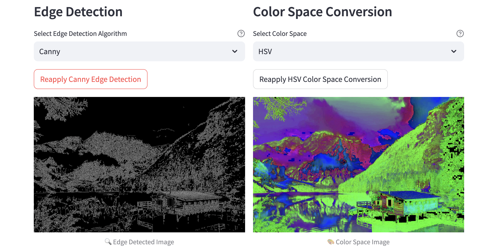
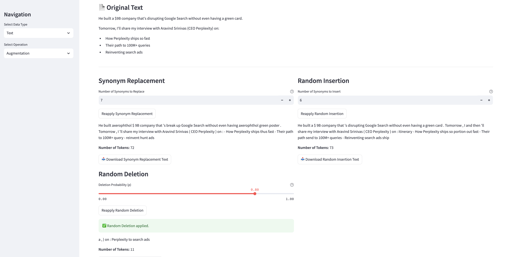
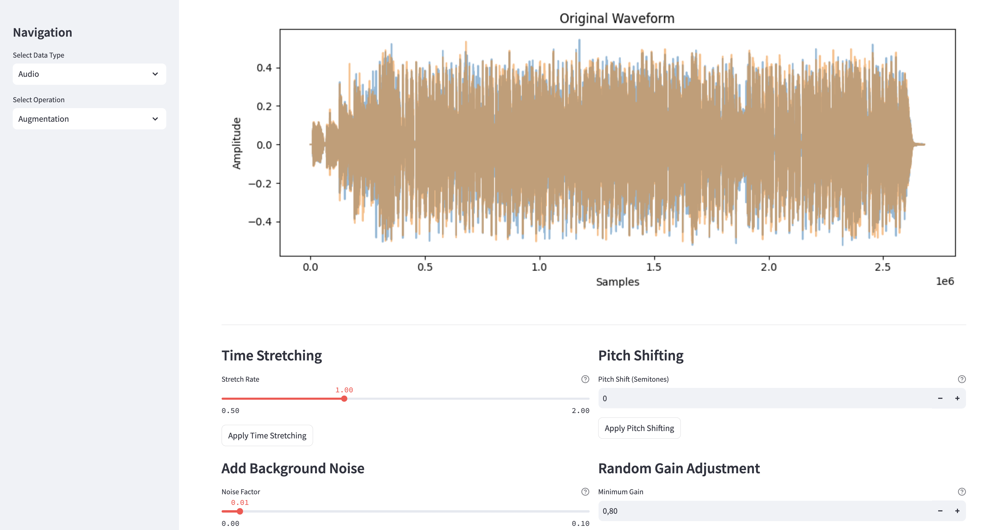
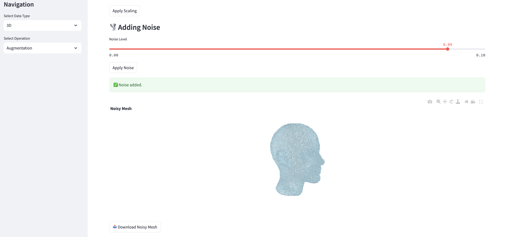

# DataPrepViz

## 📊 **Overview**

**DataPrepViz** is an interactive web application designed to streamline the data preprocessing and augmentation workflow for various data types. Built with Streamlit, it offers a user-friendly interface to apply a wide range of transformations to your data, enhancing its quality and suitability for machine learning models. Currently focused on **Image**, **Text**, and **Audio** data and **3D** data. 

## 🚀 **Features**

### 🖼️ **Image Preprocessing**

Enhance and prepare your images using a suite of preprocessing techniques:

- **Resize**
  - Adjust the dimensions of your image to the desired width and height.

- **Contrast & Brightness Adjustment**
  - Modify the contrast (α) and brightness (β) levels to improve image visibility.

- **Blurring**
  - **Gaussian Blur**: Smooth images using a Gaussian kernel.
  - **Median Blur**: Reduce noise with a median filter.
  - **Bilateral Blur**: Preserve edges while blurring.

- **Noise Addition**
  - **Gaussian Noise**: Add Gaussian-distributed noise.
  - **Salt & Pepper Noise**: Introduce salt and pepper noise for robustness testing.

- **Edge Detection**
  - **Canny Edge Detection**: Detect edges using the Canny algorithm.
  - **Sobel Edge Detection**: Highlight edges with the Sobel operator.
  - **Laplacian Edge Detection**: Capture edge details using the Laplacian method.

- **Color Space Conversion**
  - Convert images between RGB, HSV, LAB, and YCrCb color spaces.

- **Grayscale Conversion**
  - Transform color images into grayscale for simplified analysis.

- **Normalization**
  - Normalize pixel values to a standard range [0, 255] for consistency.

### 🔄 **Image Augmentation**

Enhance your dataset's diversity with powerful augmentation techniques:

- **Horizontal Flip**
  - Flip images horizontally to simulate mirror views.

- **Vertical Flip**
  - Flip images vertically to account for upside-down scenarios.

- **Rotate**
  - Rotate images by specified angles to introduce rotational invariance.

- **Random Resized Crop**
  - Crop and resize images randomly to focus on different regions.

- **Color Jitter**
  - Randomly alter brightness, contrast, saturation, and hue to mimic varying lighting conditions.

- **Affine Transformation**
  - Apply shear, scaling, and translation to distort images realistically.

- **Normalize**
  - Standardize images using ImageNet statistics for better model compatibility.

----------------------------------------------------------------

### 📄 **Text Preprocessing**

Enhance and prepare your textual data using various preprocessing techniques:

- **Tokenization**
  - Splits the input text into individual tokens (words).

- **Padding/Truncating**
  - Ensures uniform text length by padding shorter texts with `<PAD>` tokens or truncating longer texts to a specified maximum length.
  - **Controls:**
    - **Max Sequence Length:** Define the maximum number of tokens.

- **Embedding**
  - Converts tokens into numerical vectors using pre-trained BERT embeddings.

- **Token Counting**
  - Counts the number of tokens in the text using `tiktoken`.

#### **Download Options:**

- **Tokenized/Padded Text:** Download as `.txt` files.
- **Embedded Text:** Download as `.csv` files for compatibility with machine learning models.

### ✍️ **Text Augmentation**

Increase the diversity of your text data using various augmentation techniques:

- **Synonym Replacement**
  - Replaces a specified number of words in the text with their synonyms.
  - **Controls:**
    - **Number of Synonyms to Replace (n):** Specify how many words to replace.
  - **Usage:** Adjust the number of synonyms to replace and apply the augmentation.

- **Random Insertion**
  - Inserts synonyms of random words into the text.
  - **Controls:**
    - **Number of Synonyms to Insert (n):** Specify how many synonyms to insert.
  - **Usage:** Adjust the number of synonyms to insert and apply the augmentation.

- **Random Deletion**
  - Randomly deletes words from the text based on a specified probability.
  - **Controls:**
    - **Deletion Probability (p):** Probability of deleting each word.
  - **Usage:** Adjust the deletion probability and apply the augmentation.

#### **Download Options:**

- **Augmented Texts:** Download as `.txt` files.

**Note:** The **Back Translation** feature has been removed to ensure stability and eliminate dependency-related errors. Future updates may reintroduce this feature with improved reliability.

----------------------------------------------------------------

### 🎵 **Audio Preprocessing**

Enhance and prepare your audio data using various preprocessing techniques to improve quality and consistency:

- **Resampling**
  - **Description:** Resample audio to a target sampling rate (default 16,000 Hz) to ensure uniformity across your dataset.
  - **Usage:** Adjust the target sampling rate using the slider and apply resampling.

- **Feature Extraction (MFCC)**
  - **Description:** Extract Mel-Frequency Cepstral Coefficients (MFCC) to convert raw audio into meaningful features for machine learning models.
  - **Usage:** Specify the number of MFCC features and extract them from the audio signal.

#### **Download Options:**

- **MFCC Features:** Download as `.csv` files.
- **Processed Audio:** Download as `.wav` files.

### 🎶 **Audio Augmentation**

Increase the diversity of your audio data using various augmentation techniques:

- **Time Stretching**
  - **Description:** Stretch or compress the audio in time without altering the pitch.
  - **Controls:**
    - **Stretch Rate:** Adjust the factor by which to stretch the audio (e.g., 0.5x to 2.0x).
  - **Usage:** Adjust the stretch rate and apply the augmentation.

- **Pitch Shifting**
  - **Description:** Shift the pitch of the audio by a specified number of semitones.
  - **Controls:**
    - **Pitch Shift (Semitones):** Specify the number of semitones to shift the pitch (negative for lower pitch, positive for higher pitch).
  - **Usage:** Specify the pitch shift value and apply the augmentation.

- **Add Background Noise**
  - **Description:** Add random background noise to the audio to simulate real-world conditions.
  - **Controls:**
    - **Noise Factor:** Adjust the intensity of the background noise.
  - **Usage:** Adjust the noise factor and apply the augmentation.

- **Random Gain Adjustment**
  - **Description:** Randomly adjust the gain (volume) of the audio signal.
  - **Controls:**
    - **Minimum Gain:** Set the minimum gain factor.
    - **Maximum Gain:** Set the maximum gain factor.
  - **Usage:** Set the gain range and apply the augmentation.

- **Random Silence Insertion**
  - **Description:** Insert random periods of silence into the audio signal to enhance robustness.
  - **Controls:**
    - **Minimum Silence Duration (seconds):** Set the minimum duration of silence to insert.
    - **Maximum Silence Duration (seconds):** Set the maximum duration of silence to insert.
  - **Usage:** Set the silence duration range and apply the augmentation.

#### **Download Options:**

- **Augmented Audios:** Download as `.wav` files.

----------------------------------------------------------------

### 📐 **3D Data Preprocessing**

Enhance and prepare your 3D data using various preprocessing techniques:

- **Normalization**
  - **Description:** Scale the mesh to fit within a unit sphere.
  - **Usage:** Apply normalization to standardize the size of your 3D models.

- **Centering**
  - **Description:** Shift the mesh to center it at the origin.
  - **Usage:** Center your 3D models to ensure consistent positioning.

#### **Supported Formats:**
- **File Types:** `.OBJ`, `.STL`, `.PLY`

#### **Download Options:**
- **Processed Meshes:** Download as `.obj` files.

### 🎲 **3D Data Augmentation**

Increase the diversity of your 3D data using various augmentation techniques:

- **Random Rotation**
  - **Description:** Apply a random rotation around the Z-axis.
  - **Usage:** Randomly rotate your 3D models to simulate different orientations.

- **Scaling**
  - **Description:** Scale your mesh by a specified factor.
  - **Controls:**
    - **Scale Factor:** Adjust between 0.5 and 1.5.
  - **Usage:** Scale your 3D models to simulate size variations.

- **Adding Noise**
  - **Description:** Add random Gaussian noise to the mesh vertices.
  - **Controls:**
    - **Noise Level:** Adjust between 0.0 and 0.1.
  - **Usage:** Introduce slight variations to your 3D models to enhance robustness.

- **Reflection (Mirroring)**
  - **Description:** Reflect the mesh across the X, Y, or Z axis.
  - **Usage:** Generate mirrored versions of your 3D models.

- **Shearing**
  - **Description:** Apply a shearing transformation to distort the mesh.
  - **Controls:**
    - **Shear Level:** Adjust between -0.5 and 0.5.
  - **Usage:** Distort your 3D models to simulate perspective changes.

#### **Download Options:**
- **Augmented Meshes:** Download as `.obj` files.

----------------------------------------------------------------

## ⚡ **Performance Optimizations**

- **Caching Mechanisms:**
  - Leveraging Streamlit's caching (`@st.cache_data`) to ensure efficient processing and rapid response times, especially with large datasets.

